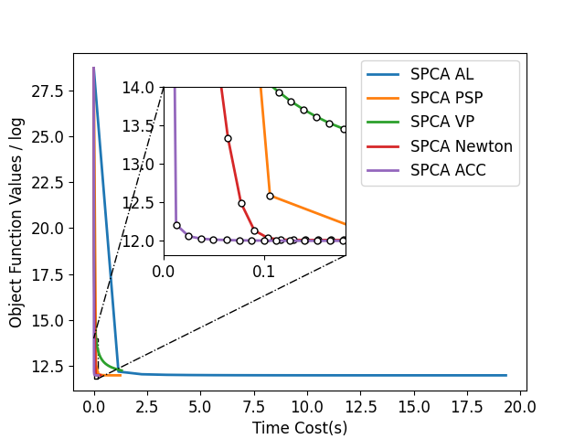

# Riemannian Acceleration for Sparse PCA with Separable Structure and Second-Order Information Exploration

This project provides the code for the paper titled **"Riemannian Acceleration for Sparse PCA with Separable Structure and Second-Order Information Exploration."**

## Requirements

To run this project, please ensure you have the following packages installed (`Python version: 3.9`):

- `matplotlib==3.8.2`
- `numpy==1.26.2`
- `pandas==2.1.4`
- `scikit_learn==1.3.2`
- `scipy==1.11.4`
- `tqdm==4.66.1`

## Running Environment in Paper

- **Operating System:** Windows 11
- **CPU:** R7 7840HS
- **RAM:** 64G

## Citations

This project builds upon the following code repositories:

1. NB Erichson, P Zheng, K Manohar, SL Brunton, JN Kutz, AY Aravkin, **Sparse principal component analysis via variable projection**, SIAM Journal on Applied Mathematics, 2020, [GitHub Link](https://github.com/erichson/ristretto)
2. AK Seghouane, N Shokouhi, I Koch, **Sparse principal component analysis with preserved sparsity pattern**, IEEE Transactions on Image Processing, 2019, [GitHub Link](https://github.com/idnavid/sparse_PCA)

## How to Use

1. Clone the repository.
2. Install the required packages listed above.
3. Follow the instructions in the code to explore the Sparse PCA implementation.

## Example

Here we provide an example showcasing the performance of different algorithms on the COIL20 dataset. The following figures illustrate the detailed time overhead and convergence curves for each algorithm, as well as a visual representation of how the feature vectors (reshaped into matrices) change during the iterations.

### Detail Time Cost Comparison

| Algorithm    |   Accuracy    | $n_{iter}$ |    $t_{iter}$    |    $t_{\mathbf{A}}$    |    $t_{\mathbf{B}}$    |   $t_{Acc}$   |
|--------------|:-------------:|:----------:|:-----------------:|:----------------------:|:----------------------:|:-------------:|
| SPCA AL      | 0.990741     |     17     |     15.266953     |        0.033533        |       15.353608        |    0.0000   |
| SPCA PSP     | 0.969907     |     12     |      1.272334     |        0.028723        |        1.042403        |    0.0000   |
| SPCA VP      | 0.935185     |    100     |      1.413136     |        0.184215        |        0.067675        |    0.0000   |
| SPCA Newton  | 0.983796     |     25     |      0.394094     |        0.048328        |        0.005514        |    0.0000   |
| SPCA ACC     | 0.983796     |     17     |      0.294596     |        0.032403        |        0.002985        |    0.0004   |

Due to variations in computational capabilities across different devices, the runtime may exhibit slight discrepancies from the values presented in the table. However, the classification accuracy, number of iterations, and variations in the objective function values remain consistent across devices.

### Convergence Curves

*Figure 1: Convergence curves of different algorithms on the COIL20 dataset.*

## Note
1. This project includes all datasets mentioned in the paper except for MNIST. Due to size limitations on GitHub, the MNIST dataset cannot be directly included. Instead, we provide `get_mnist` to generate the MNIST.mat file in the data folder in a format compatible with the provided code.

2. We provide code to plot local zoomed-in views for a more intuitive observation of the local trend of the curves. However, these zoom blocks depend on the values of the x and y coordinates, and the ranges of these blocks may need to be adjusted accordingly when running on devices with different computational capabilities (especially the x-axis).

3. Due to significant differences in computational capabilities across devices, the time overhead for running the same code may vary greatly. Additionally, even on the same device, the time overhead may differ across multiple runs (this is particularly noticeable with smaller datasets. You can adjust the `repeat` parameter to achieve a more stable average). This may lead to slight deviations in the slope angles of the curves plotted compared to those presented in the paper.

4. To facilitate a more intuitive observation of the impact of each update step on the algorithm’s performance, we have consolidated the SPCA_VP, SPCA_Newton, and SPCA_ACC algorithms, as mentioned in the paper, into a single Python script (`spca_vp.py`). By adjusting the parameters self.newton and self.acc, the respective algorithms can be implemented. The shared timing statistics and update steps across these algorithms ensure a fair and clear comparison.
